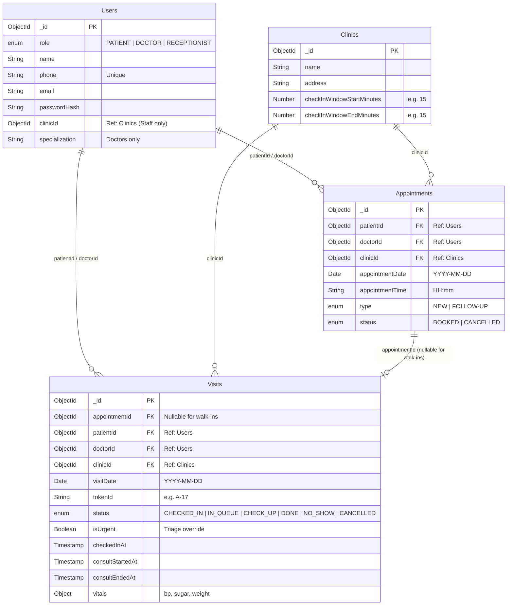
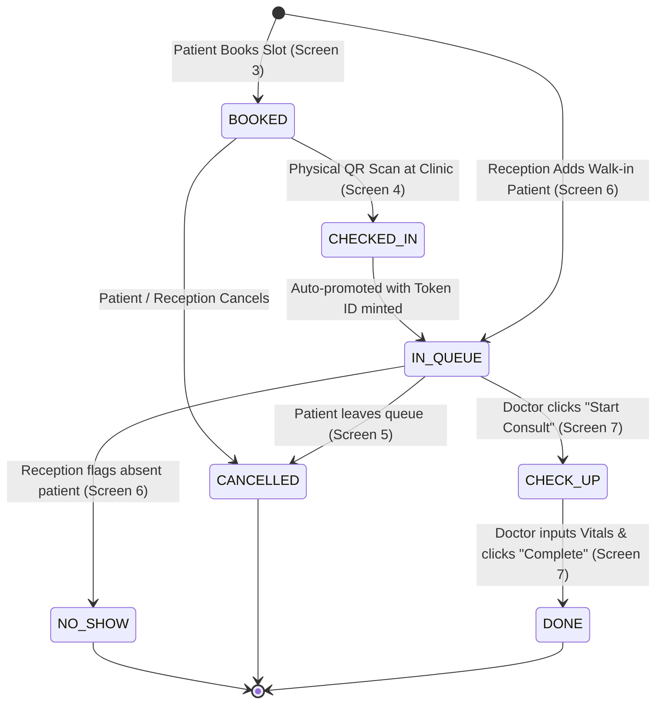

# QureFlow MVP: UI/UX Architecture & Screen Specification
*(Winter Arctic Frost Edition)*

**System:** QureFlow Real-Time Clinic Queue Management Platform  
**Role:** Senior Product Designer & Frontend Architect  
**MVP Scope:** 7 Core Screens across 3 Persona Tiers (`Guest`, `Patient / User`, `Clinic Staff / Admin`)  
**Design System Reference:** [style-guide.md](file:///c:/Users/junaid/Desktop/mediQ/docs/style-guide.md)  
**Backend & Architecture References:** [features.md](file:///c:/Users/junaid/Desktop/mediQ/docs/features.md) | [mvp-ideation.md](file:///c:/Users/junaid/Desktop/mediQ/docs/mvp-ideation.md)  
**Component Standards:** shadcn/ui (Radix Primitives + CSS Variables)  
**Iconography Standards:** Font Awesome 6 (`fa-*`) & Material UI (`@mui/icons-material` / Material Symbols)

---

## 1. Executive Summary & Core Architectural Principles

QureFlow eliminates unpredictable clinic waiting room delays by synchronizing patients, receptionists, and doctors around a single, real-time live queue engine. 

### Core Product Mechanics & Architectural Rules:

1. **Anti-Ghost Queue Rule (Decoupled Booking vs. Live Queue):**
   * Booking an appointment in `Appointments` secures a reserved slot with status `BOOKED`.
   * **An appointment does NOT place the patient in the live physical queue.**
   * Only physical presence validated via QR scan at clinic entrance (or manual reception triage) generates a `Visits` document with a visit-specific `tokenId` (e.g., `#A-17`) and sets status to `IN_QUEUE`.
   * This guarantees that waiting screens, doctor queues, and reception dashboards reflect 100% physically present patients.

2. **Dual-Identifier Architecture:**
   * **Permanent Patient ID (`Users._id`):** Persistent across lifetime visits, linked to patient demographics, records, and history.
   * **Visit-Specific Token ID (`Visits.tokenId`):** Daily sequential alphanumeric token (e.g., `A-01`, `A-17`, `B-04`) minted at physical check-in and discarded upon visit completion (`DONE`).

3. **Dynamic Elastic ETA Engine:**
   * Waiting times are never rendered as static timestamps (e.g., "10:45 AM"), which break trust when consultations run over.
   * Wait times are rendered as **elastic dynamic ranges** (e.g., `25–35 mins`), computed as:
     $$\text{ETA Range} = (\text{Patients Ahead} \times \overline{T}_{\text{consult}}) + T_{\text{remaining active consult}}$$
     where $\overline{T}_{\text{consult}}$ is the doctor's recent rolling average consultation duration.

4. **Winter Arctic Frost Color Architecture:**
   * **Primary Colors:** `Snow White (#FFFFFF)` (cards, modals, clean surfaces) and `Frost Mist (#EAF4FF)` (ambient glare-free icy canvas).
   * **Secondary Colors:** `Deep Winter Blue (#17345C)` (authoritative brand tone, primary buttons, active queue pills) and `Frost Navy (#071629)` (deep frozen midnight headers, navigation bars, dense table headers).
   * **Accent Colors:** `Icy Steel (#9DB7D5)` (cool metallic accent, dividers, focus rings, chip borders) and `Midnight Black (#050B14)` (maximum contrast base).

5. **Mandatory High-Contrast Rule (WCAG AAA):**
   * Any text or icon placed over Secondary Blues (`Deep Winter Blue #17345C` or `Frost Navy #071629`) **MUST ALWAYS USE LIGHT COLORS** — predominantly **`Snow White #FFFFFF`** or **`Frost Mist #EAF4FF`** (Contrast ratio $\ge 9.8 : 1$, exceeding WCAG AAA).

6. **Flipped Dark Mode Architecture:**
   * In dark mode, the color ratios are flipped: Canvas becomes `Frost Navy (#071629)`, cards become elevated midnight blues (`#0D1F38` / `#17345C`), typography becomes `Snow White (#FFFFFF)` / `Frost Mist (#EAF4FF)`, and primary CTAs transition to `Icy Steel (#9DB7D5)` with `Frost Navy (#071629)` text.

7. **shadcn/ui & Dual Icon Engine:**
   * Built on **shadcn/ui** components (`Button`, `Card`, `Badge`, `Input`, `Dialog`, `Sheet`, `Tabs`, `Table`, `Select`, `Skeleton`, `Toast`).
   * Visual actions are reinforced using **Font Awesome 6** and **Material UI (`@mui/icons-material`)** icons with a unified `8px` border radius across all elements.

---

## 2. Database Schema & Data Mapping Matrix

Every screen in QureFlow is directly bound to the MongoDB database schema defined in [features.md](file:///c:/Users/junaid/Desktop/mediQ/docs/features.md):



### Screen to Database Mapping Reference

| Screen Name | Prototype File | Primary Collections Read | Primary Collections Written | Key Schema Fields Bound |
| :--- | :--- | :--- | :--- | :--- |
| **1. Auth Gateway** | [`1-auth.html`](file:///c:/Users/junaid/Desktop/mediQ/design/1-auth.html) | `Users`, `Clinics` | `Users` (on register) | `Users.username`, `Users.email`, `Users.passwordHash`, `Users.role`, `Users.clinicId` |
| **2. Patient Home** | [`patient-home.html`](file:///c:/Users/junaid/Desktop/mediQ/design/patient-home.html) | `Visits`, `Appointments`, `Users`, `Clinics` | None (Read / Nav hub) | `Visits.tokenId`, `Visits.status`, `Appointments.appointmentDate`, `Appointments.appointmentTime`, `Users.name` |
| **3. Slot Booking** | [`2-booking.html`](file:///c:/Users/junaid/Desktop/mediQ/design/2-booking.html) | `Users` (Doctors), `Appointments` | `Appointments` | `Appointments.patientId`, `Appointments.doctorId`, `Appointments.appointmentDate`, `Appointments.appointmentTime`, `Appointments.type`, `Appointments.status = 'BOOKED'` |
| **4. QR Check-In** | [`3-checkin.html`](file:///c:/Users/junaid/Desktop/mediQ/design/3-checkin.html) | `Appointments`, `Clinics` | `Visits` | `Clinics.checkInWindowStartMinutes`, `Clinics.checkInWindowEndMinutes`, `Visits.tokenId`, `Visits.status = 'IN_QUEUE'`, `Visits.checkedInAt` |
| **5. Live Queue** | [`4-queue.html`](file:///c:/Users/junaid/Desktop/mediQ/design/4-queue.html) | `Visits`, `Users`, `Appointments` | `Visits` (Cancel action) | `Visits.tokenId`, `Visits.status`, `Visits.consultStartedAt`, Dynamic Position & Patients Ahead, Doctor status |
| **6. Reception Console** | [`5-reception.html`](file:///c:/Users/junaid/Desktop/mediQ/design/5-reception.html) | `Visits`, `Appointments`, `Users` | `Visits`, `Appointments` | `Visits.tokenId`, `Visits.status` (`NO_SHOW`, `IN_QUEUE`), `Visits.isUrgent`, `Visits.appointmentId = null` (Walk-ins) |
| **7. Doctor Desk** | [`6-doctor.html`](file:///c:/Users/junaid/Desktop/mediQ/design/6-doctor.html) | `Visits`, `Users`, `Appointments` | `Visits`, `Users` | `Visits.status` (`CHECK_UP`, `DONE`), `Visits.consultStartedAt`, `Visits.consultEndedAt`, `Visits.vitals = { bp, sugar, weight }` |

---

## 3. End-to-End Visit State Machine & Ownership

The clinic queue follows a deterministic state machine strictly governed by actor roles:



### State Ownership & Transitions:
* **`BOOKED` (Appointments):** Triggered by **Patient** via `POST /api/v1/appointments`. Slot secured, no live token exists yet.
* **`CHECKED_IN` → `IN_QUEUE` (Visits):** Triggered by **Patient QR Scan** via `POST /api/v1/visits/check-in` (or **Reception Manual Triage**). Verifies physical arrival within `checkInWindowStartMinutes` / `checkInWindowEndMinutes` window (±15 mins of `Appointments.appointmentTime`). Creates `Visits` entry, mints `tokenId` (`#A-17`), sets `checkedInAt = NOW()`, emits `QUEUE_UPDATED`.
* **`IN_QUEUE` (Visits):** State of passive waiting. Position in queue is calculated in real time based on earlier active visits.
* **`CHECK_UP` (Visits):** Triggered by **Doctor** via `PUT /api/v1/visits/:id/start`. Sets `consultStartedAt = NOW()`, starts consultation timer, emits `VISIT_CALLED` WebSocket event.
* **`DONE` (Visits):** Triggered by **Doctor** via `PUT /api/v1/visits/:id/complete`. Records `vitals: { bp, sugar, weight }`, sets `consultEndedAt = NOW()`, ends consultation timer, emits `VISIT_COMPLETED` and `QUEUE_UPDATED`.
* **`NO_SHOW` (Visits):** Triggered by **Receptionist** via `PUT /api/v1/visits/:id/status` with `{ status: "NO_SHOW" }`. Immediately reallocates queue positions and drops wait times for remaining patients.
* **`CANCELLED` (Appointments / Visits):** Triggered by **Patient** or **Receptionist**.

---

## 4. Complete Screen Inventory & Hierarchy

The application interface consists of **7 modular screens** designed for specific viewports and user environments:

```
├── GUEST / PUBLIC TIER
│   └── Screen 01: Authentication & Role Gateway (1-auth.html) [Mobile / Desktop Responsive]
│
├── PATIENT EXPERIENCE TIER (Optimized for Mobile Web / 390px - 430px)
│   ├── Screen 02: Patient Home Dashboard (patient-home.html)
│   ├── Screen 03: Doctor Discovery & Slot Booking (2-booking.html)
│   ├── Screen 04: QR Physical Arrival Check-In (3-checkin.html)
│   └── Screen 05: Live Queue & Dynamic ETA Tracker (4-queue.html)
│
└── CLINIC STAFF OPERATIONS TIER (Optimized for Desktop / Tablet 1024px+)
    ├── Screen 06: Reception Queue & Triage Console (5-reception.html)
    └── Screen 07: Doctor Consultation & Vitals Desk (6-doctor.html)
```

---

## 5. Detailed Screen Specifications

---

### Screen 01: Authentication & Role Gateway
* **File Reference:** [`design/1-auth.html`](file:///c:/Users/junaid/Desktop/mediQ/design/1-auth.html) / [`design/js/1-auth.js`](file:///c:/Users/junaid/Desktop/mediQ/design/js/1-auth.js)
* **Target Role:** Guest (`PATIENT`, `RECEPTIONIST`, `DOCTOR`)
* **Purpose:** Single unified authentication gateway with two role tracks and two patient sub-modes (Login / Register). Credentials are email/username + password only — **no OTP, no SMS, no phone-based auth**.
* **Tech Stack:** React component, React Context API (auth state), React Router redirect on JWT receipt, Joi-mirrored client-side validation.

#### 1. Database & API Contract
* **Collection:** `Users`, `Clinics`
* **Fields Read/Written:** `Users.username`, `Users.email`, `Users.passwordHash`, `Users.role`, `Users.name`, `Users.clinicId`
* **API Endpoints:**
  * **Register:** `POST /api/v1/auth/register`
    * **Request Body:** `{ name: "Rahul Verma", username: "rahul_v", email: "rahul@gmail.com", password: "Secure#123" }`
    * **Response:** `201 Created` → `{ token: "jwt...", user: { id, name, username, role: "PATIENT", email } }`
    * **Conflict Errors:** `409 EMAIL_TAKEN` | `409 USERNAME_TAKEN`
  * **Login:** `POST /api/v1/auth/login`
    * **Request Body:** `{ identifier: "rahul@gmail.com" OR "rahul_v", password: "Secure#123" }` *(patient)*
    * **Request Body (Staff):** `{ identifier: "dr.sharma@apollo.com", password: "...", clinicId: "...", role: "DOCTOR" }`
    * **Response:** `200 OK` → `{ token: "jwt...", user: { id, name, username, role, clinicId? } }`
    * **Error:** `401 INVALID_CREDENTIALS` (generic — prevents user enumeration)

#### 2. Key UI Components (shadcn/ui & Icons)
* **Top-Level `Tabs` (`shadcn/ui: tabs`):** Segmented 2-pill control (`Patient` vs `Clinic Staff`). Icons: `fa-solid fa-user` / `PersonOutline` and `fa-solid fa-user-doctor` / `MedicalServices`.
* **Patient Sub-Mode Tabs:** Inline underline-style tabs for `Sign In` (`fa-solid fa-right-to-bracket`) and `Create Account` (`fa-solid fa-user-plus`).
* **`Card` (`shadcn/ui: card`):** Background `Snow White (#FFFFFF)`, Border `1px solid #D4E4F5`, Radius `8px`, Padding `24px`.
* **`Input` (`shadcn/ui: input`) — Patient Login:**
  * `Email or Username` field (accepts both; `@` detection used to distinguish on backend).
  * `Password` field with `fa-solid fa-eye` / `fa-eye-slash` visibility toggle button.
* **`Input` (`shadcn/ui: input`) — Patient Register:**
  * `Full Name`, `Username` (Joi: alphanum+underscore, 3–30 chars), `Email`, `Password`.
  * Password Strength Indicator: 3-tier `weak / fair / strong` progress bar below password field.
* **`Input` / `Select` (`shadcn/ui`) — Staff:**
  * Clinic Selector Dropdown (populates from `Clinics.name`).
  * Staff Role Toggle Pills (`Doctor Console` / `Reception Desk`).
  * Email + Password inputs with visibility toggle.
* **`Branding & Trust`:** `fa-solid fa-shield-halved` shield with `"256-bit encrypted healthcare portal"`.

#### 3. Primary CTA & Contrast Rule
* **Primary CTA (`shadcn/ui: button`):**
  * **`Sign In`** *(Patient Login)* or **`Create Account`** *(Patient Register)* or **`Sign In to Doctor Console`** / **`Sign In to Reception Desk`** *(Staff)*.
  * **Visual Tokens:** Background **`Deep Winter Blue (#17345C)`**, Text **`Snow White (#FFFFFF)`** (Contrast: 9.8:1), Height `44px`, Radius `8px`.
  * *Dark Mode:* Background **`Icy Steel (#9DB7D5)`**, Text **`Frost Navy (#071629)`**.
  * **Disabled State:** `opacity: 0.5; pointer-events: none` until all required fields pass client-side Joi validation.
* **Secondary Actions:** `Forgot password?` (Patient Login) in `Deep Winter Blue (#17345C)`. Tab toggle link *"Already have an account? Sign In"* in same brand blue.

#### 4. UI States & Edge Cases
* **Loading:** Inputs disabled, CTA displays `<div class="spinner">` (white circular ring) and text `"Signing in..."` / `"Creating account..."` / `"Authenticating..."`. CTA icon temporarily hidden.
* **Empty:** All form fields blank or not yet valid. CTA disabled (`opacity: 0.5`).
* **Error (Login):** Alert box displayed above form:
  * *Invalid credentials:* `"Invalid email/username or password."` (generic — prevents enumeration).
* **Error (Register):**
  * *Username invalid format:* Inline under field `"3–30 characters: letters, numbers, underscores only."`
  * *Email conflict (409):* Alert: `"An account with this email already exists."` with `Sign In` link.
  * *Username conflict (409):* Alert: `"This username is already taken. Please choose another."`
* **Error (Staff):** `"No matching staff record found. Check your clinic selection."`
* **Success:** Green alert banner (`fa-solid fa-circle-check`), JWT stored in `localStorage (key: 'qureflow_token')`, React Context authState updated, then React Router redirects:
  * `PATIENT` → Screen 02 (`patient-home.html`)
  * `RECEPTIONIST` → Screen 06 (`5-reception.html`)
  * `DOCTOR` → Screen 07 (`6-doctor.html`)

---

### Screen 02: Patient Home Dashboard
* **File Reference:** [`design/patient-home.html`](file:///c:/Users/junaid/Desktop/mediQ/design/patient-home.html) / [`design/js/patient-home.js`](file:///c:/Users/junaid/Desktop/mediQ/design/js/patient-home.js)
* **Target Role:** Patient (`Users.role === 'PATIENT'`)
* **Purpose:** Central command hub for patients that dynamically alters its primary context card based on active visit state (`NO_APPOINTMENT` vs `BOOKED` vs `IN_QUEUE` vs `DONE`).

#### 1. Database & API Contract
* **Collections Read:** `Visits`, `Appointments`, `Users`, `Clinics`
* **API Endpoints:**
  * `GET /api/v1/visits/my-status` (Check for active token today)
  * `GET /api/v1/appointments/my-upcoming` (Check for today's scheduled slot)
  * `GET /api/v1/doctors/active` (List available specialists)

#### 2. Key UI Components (shadcn/ui & Icons)
* **Header Bar:** Greeting (`"Hello, Rahul"`), Notification Bell (`fa-regular fa-bell` / `NotificationsNone`), `Avatar` (`shadcn/ui: avatar`).
* **Dynamic Active Context Card (`shadcn/ui: card`):**
  * *State A (Live Token Active - `IN_QUEUE` / `CHECK_UP`):* Inset left border `4px solid #17345C`. Prominent badge `#A-17`, Live Position (`3 ahead`), Estimated Wait (`25–35m`), Doctor Name with `fa-solid fa-stethoscope`. Direct CTA: `Track Live Queue →`.
  * *State B (Upcoming Booking Today - `BOOKED`):* Card displaying Doctor Name, Scheduled Time (`10:30 AM`), Visit Type (`NEW`), and live arrival status pill (`Check-in opens in 15 mins` or `Ready to Check-in!`). CTA: `Scan QR Check-In →`.
  * *State C (Zero State - No Visits Today):* Friendly card stating *"No appointments scheduled today"*. CTA: `Book an Appointment →`.
* **Quick Actions Grid (4-Tile System with `Card`):**
  1. `Book Doctor Slot` (`fa-solid fa-calendar-plus` / `CalendarMonth`)
  2. `Scan QR Check-In` (`fa-solid fa-qrcode` / `QrCodeScanner`)
  3. `Live Queue Token` (`fa-solid fa-users-line` / `PeopleAlt`)
  4. `Past Consultations & Vitals` (`fa-solid fa-file-waveform` / `MedicalInformation`)
* **Specialists on Duty Section:** Horizontal card deck of active clinic doctors (`Users.name`, `Users.specialization`, `Badge` indicator).
* **Clinic Operational Status Banner:** Real-time badge (`Clinic Open • OPD Session Active`).

#### 3. Primary CTA & Contrast Rule
* **Primary CTA (`shadcn/ui: button`):** Contextually bound:
  * When `IN_QUEUE`: **`Open Live Queue Tracker`** (Background: `#17345C`, Text: `#FFFFFF`)
  * When `BOOKED`: **`Scan Clinic QR Code`** (Background: `#17345C`, Text: `#FFFFFF`)
  * When Idle: **`Book Doctor Appointment`** (Background: `#17345C`, Text: `#FFFFFF`)
* **Secondary Action:** `View Clinic Info` / `Contact Helpdesk`

#### 4. UI States & Edge Cases
* **Loading:** Pulsing `Skeleton` (`shadcn/ui: skeleton`) placeholders for active context card and specialist carousel.
* **Empty:** Idle hero state inviting patient to schedule a consultation.
* **Error:** Offline banner with cached previous visit info and manual retry button (`fa-solid fa-arrows-rotate`).
* **Success:** Fluid, reactive card transition reflecting background WebSocket updates.

---

### Screen 03: Doctor Discovery & Slot Booking
* **File Reference:** [`design/2-booking.html`](file:///c:/Users/junaid/Desktop/mediQ/design/2-booking.html) / [`design/js/2-booking.js`](file:///c:/Users/junaid/Desktop/mediQ/design/js/2-booking.js)
* **Target Role:** Patient (`Users.role === 'PATIENT'`)
* **Purpose:** Browse clinic doctors, choose consultation type (`NEW` vs `FOLLOW-UP`), select appointment date and time slot, and commit an appointment record.

#### 1. Database & API Contract
* **Collections:** `Users` (Doctors), `Appointments`, `Clinics`
* **Fields Written:** `Appointments.patientId`, `Appointments.doctorId`, `Appointments.clinicId`, `Appointments.appointmentDate`, `Appointments.appointmentTime`, `Appointments.type`, `Appointments.status = 'BOOKED'`.
* **API Endpoint:** `POST /api/v1/appointments`
  * **Request Body:** `{ doctorId: "doc_123", clinicId: "clinic_001", appointmentDate: "2026-09-27", appointmentTime: "10:30", type: "NEW" }`
  * **Response Body:** `{ appointmentId: "appt_987", status: "BOOKED", checkInWindow: { start: "10:15", end: "10:45" } }`

#### 2. Key UI Components (shadcn/ui & Icons)
* **Doctor Profile Header (`shadcn/ui: card`):** Doctor avatar, Name (`Dr. Priya Sharma`), Speciality (`MD, Cardiologist`), and consultation duration pill (`fa-regular fa-clock` `~12 min / patient`).
* **Visit Type Selector (`shadcn/ui: tabs`):** Segmented toggle (`New Consultation` vs `Follow-Up Consultation`).
* **7-Day Horizontal Date Carousel:** Swipeable day chips displaying Day (`Mon`), Date (`28`), and Month (`Sep`) with available slot count badges.
* **Time Slot Grid Grouped by Session:**
  * Morning Session (`fa-regular fa-sun` 09:00 AM – 12:30 PM)
  * Afternoon Session (`fa-solid fa-cloud-sun` 02:00 PM – 05:00 PM)
  * Evening Session (`fa-regular fa-moon` 06:00 PM – 08:30 PM)
  * Slot states: Available (Snow White with `#D4E4F5` border), Selected (`Deep Winter Blue #17345C` fill, `Snow White #FFFFFF` text), Booked (disabled).
* **Sticky Booking Summary Bar:** Selected Date, Time Slot, Visit Type, and primary CTA.

#### 3. Primary CTA & Contrast Rule
* **Primary CTA (`shadcn/ui: button`):** **`Confirm & Book Slot`**
  * **Visual Tokens:** Background **`Deep Winter Blue (#17345C)`**, Text **`Snow White (#FFFFFF)`**, Icon `fa-solid fa-calendar-check` / `CheckCircle`, Height `44px`, Radius `8px`.
* **Secondary Action:** `Change Doctor` / `Back to Home`

#### 4. UI States & Edge Cases
* **Loading:** Doctor profile skeleton and shimmering slot pills.
* **Empty:** Zero state illustration *"No slots open for selected date"* with button *"View Next Available Day"*.
* **Error:** Slot collision toast: *"Slot 10:30 AM was just booked by another patient. Refreshed slots."* Automatically selects next open slot.
* **Success:** `Dialog` confirmation overlay displaying `appointmentId`, QR check-in instructions (15-min arrival window), and button to **Screen 02 / 04**.

---

### Screen 04: QR Physical Arrival & Check-In
* **File Reference:** [`design/3-checkin.html`](file:///c:/Users/junaid/Desktop/mediQ/design/3-checkin.html) / [`design/js/3-checkin.js`](file:///c:/Users/junaid/Desktop/mediQ/design/js/3-checkin.js)
* **Target Role:** Patient (`Users.role === 'PATIENT'`)
* **Purpose:** Physically validate patient presence at clinic premises by scanning the entrance QR code. Validates slot time against `Clinics.checkInWindowStartMinutes` and `Clinics.checkInWindowEndMinutes` (±15 mins), mints a live visit token, and transitions state from `BOOKED` to `IN_QUEUE`.

#### 1. Database & API Contract
* **Collections:** `Appointments`, `Clinics`, `Visits`
* **Validation Logic:** Checks:
  $$\text{AppointmentTime} - \text{checkInWindowStartMinutes} \le \text{CurrentTime} \le \text{AppointmentTime} + \text{checkInWindowEndMinutes}$$
* **Fields Written:** Insert into `Visits`: `appointmentId`, `patientId`, `doctorId`, `clinicId`, `visitDate`, `tokenId` (e.g., `"A-17"`), `status = 'IN_QUEUE'`, `isUrgent = false`, `checkedInAt = NOW()`.
* **API Endpoint:** `POST /api/v1/visits/check-in`
  * **Request Body:** `{ clinicId: "clinic_001", appointmentId: "appt_987" }`
  * **Response Body:** `{ visitId: "visit_456", tokenId: "A-17", status: "IN_QUEUE", position: 4, ETA: { minMinutes: 30, maxMinutes: 45 } }`
* **WebSocket Signal Emitted:** Emits `QUEUE_UPDATED` to Reception and Doctor.

#### 2. Key UI Components (shadcn/ui & Icons)
* **Target Booking Card (`shadcn/ui: card`):** Doctor Name, Booked Slot Time (`10:30 AM`), Clinic Name, Cabin number.
* **Arrival Window Status Badge (`shadcn/ui: badge`):** `fa-regular fa-clock` / `AccessTime` with text *"Check-in Window: 10:15 AM - 10:45 AM"*.
* **Live Camera Viewfinder Reticle:** Modern camera viewport with corner framing guides, center reticle (`fa-solid fa-qrcode` / `QrCodeScanner`), and animated laser scanning beam.
* **Manual Code Fallback (`shadcn/ui: dialog`):** 6-digit PIN input container *"Camera not working? Enter 6-digit desk code"*.
* **Permission Banner:** Alert with camera enable button if permissions denied.

#### 3. Primary CTA & Contrast Rule
* **Primary CTA (`shadcn/ui: button`):** **`Scan Clinic QR Code`** (or **`Submit 6-Digit Code`**)
  * **Visual Tokens:** Background **`Deep Winter Blue (#17345C)`**, Text **`Snow White (#FFFFFF)`**, Icon `fa-solid fa-qrcode`, Height `44px`, Radius `8px`.
* **Secondary Action:** `Enter Code Manually` / `Approach Reception Desk`

#### 4. UI States & Edge Cases
* **Loading:** Camera viewfinder translucent blur with animated scanning radar and microcopy *"Verifying clinic location..."*.
* **Empty:** *"No booked appointments found for today"* with secondary link to `"Book a Slot"` or `"Approach Reception Desk"`.
* **Error:** 
  * *Too Early:* Bottom sheet alert: *"Check-in Denied: Your check-in window opens at 10:15 AM (15 mins prior to slot)."*
  * *Too Late / Expired:* Alert banner: *"Check-in Window Expired: Your 10:30 AM arrival window closed at 10:45 AM. Approach Reception for walk-in re-triage."*
  * *Wrong QR:* *"Invalid QR Code: Code does not belong to this clinic."*
* **Success:** Haptic buzz + chime; triggers **Token Issued Modal** displaying:
  * **Token `#A-17`**
  * Status: `Checked In • Added to Live Queue`
  * Initial Position: `4 Patients Ahead`
  * Auto-navigates to **Screen 05 (Live Queue)** in 2 seconds.

---

### Screen 05: Patient Live Queue & Dynamic ETA Tracker
* **File Reference:** [`design/4-queue.html`](file:///c:/Users/junaid/Desktop/mediQ/design/4-queue.html) / [`design/js/4-queue.js`](file:///c:/Users/junaid/Desktop/mediQ/design/js/4-queue.js)
* **Target Role:** Patient (`Users.role === 'PATIENT'`)
* **Purpose:** Alleviate waiting room anxiety through real-time, WebSocket-synchronized queue visibility: dynamic token countdown, elastic ETA range, consult stepper, and turn alerts.

#### 1. Database & API Contract
* **Collections Read:** `Visits`, `Users`, `Clinics`
* **API Endpoint:** `GET /api/v1/visits/my-status`
  * **Response Body:**
    ```json
    {
      "tokenId": "A-17",
      "status": "IN_QUEUE",
      "position": 3,
      "patientsAhead": 2,
      "currentlyServing": "A-15",
      "ETA": { "minMinutes": 20, "maxMinutes": 30 },
      "doctor": { "name": "Dr. Priya Sharma", "cabin": "Cabin 02", "status": "AVAILABLE" }
    }
    ```
* **WebSocket Events Listened To:**
  * `QUEUE_UPDATED`: Recalculates position, patients ahead, and dynamic ETA range.
  * `DOCTOR_STATUS_CHANGED`: Updates doctor availability pill (`AVAILABLE` vs `ON_BREAK`).
  * `VISIT_CALLED`: When `visit.tokenId === myTokenId`, transitions status to `CHECK_UP` and displays Fullscreen Turn Modal.
  * `VISIT_COMPLETED`: When consultation finishes, moves status to `DONE`.

#### 2. Key UI Components (shadcn/ui & Icons)
* **Top Navigation Bar:** Clinic Name, Doctor Name, and Live Sync indicator (`fa-solid fa-arrows-rotate` `● Live Sync`).
* **Token Hero Display Card (`shadcn/ui: card`):**
  * Giant high-contrast token number (`#A-17`) in `Netflix Sans`.
  * Active state badge: `IN_QUEUE` in `Deep Winter Blue (#17345C)` fill with **`Snow White (#FFFFFF)`** text.
* **Live 3-Metric Queue Cluster (`Card` Grid):**
  1. **Patients Ahead:** Numerical counter (`fa-solid fa-users-line` / `PeopleAlt` `2 Ahead`).
  2. **Estimated Wait Range:** Elastic range (`fa-regular fa-clock` / `AccessTime` `20–30 mins`).
  3. **Currently Serving:** Active token in doctor cabin (`fa-solid fa-stethoscope` / `LocalHospital` `#A-15 • In Cabin 2`).
* **5-Step State Machine Stepper:**
  `BOOKED` (✓) $\to$ `CHECKED_IN` (✓) $\to$ `IN_QUEUE` (Active Pulsing Ring) $\to$ `CHECK_UP` $\to$ `DONE`.
* **Doctor Live Indicator (`shadcn/ui: badge`):** Status pill showing `Dr. Priya Sharma • Active in Consultation` or `Doctor on 10m Tea Break (ETA adjusted +10 mins)`.
* **Proximity Alert Banner:** Animates in when `patientsAhead <= 1`: *"You're Next! Please remain near Cabin 02."*
* **Turn Notification Dialog (`shadcn/ui: dialog`):** When doctor calls token, launches modal with audio chime: *"Token #A-17: It's Your Turn! Please proceed inside Cabin 02."* Header: `Frost Navy (#071629)`, Text: `Snow White (#FFFFFF)`.
* **Ghost Action:** `Leave Queue / Cancel Visit` (triggers confirmation dialog).

#### 3. Primary CTA & Contrast Rule
* **Primary CTA (`shadcn/ui: button`):** **`Refresh Live Status`**
  * **Visual Tokens:** Background **`Deep Winter Blue (#17345C)`**, Text **`Snow White (#FFFFFF)`**, Icon `fa-solid fa-arrows-rotate`, Height `44px`, Radius `8px`.
* **Secondary Action:** `View Waiting Area Map` / `Leave Queue`

#### 4. UI States & Edge Cases
* **Loading:** Pulsing `Skeleton` across token number, ETA range, and position counter.
* **Empty:** Standby card: *"You do not have an active queue token for today"* with CTA to *"Scan Arrival QR"*.
* **Error:** WebSocket disconnected banner *"Connection lost. Retrying live sync..."* with manual *"Reconnect"* button. Displays last cached ETA with timestamp.
* **Success:** Smooth animated decrement of position counter (`3 ahead` $\to$ `2 ahead`) on doctor advancement. On `status: DONE`, screen renders a **Visit Summary Card** with basic logged vitals and discharge timestamp.

---

### Screen 06: Reception Queue & Triage Console
* **File Reference:** [`design/5-reception.html`](file:///c:/Users/junaid/Desktop/mediQ/design/5-reception.html) / [`design/js/5-reception.js`](file:///c:/Users/junaid/Desktop/mediQ/design/js/5-reception.js)
* **Target Role:** Clinic Receptionist (`Users.role === 'RECEPTIONIST'`)
* **Purpose:** Operational control deck for clinic desk staff to track physical arrivals, register unscheduled walk-in patients, flag absent no-shows, and perform manual queue overrides.

#### 1. Database & API Contract
* **Collections Read / Written:** `Visits`, `Appointments`, `Users`, `Clinics`
* **API Endpoints:**
  * `GET /api/v1/visits?clinicId=:id&date=today` (Fetch live queue table)
  * `POST /api/v1/visits/walk-in`
    * **Request Body:** `{ clinicId: "clinic_001", patientName: "Aman Gupta", phone: "9812345678", doctorId: "doc_123", type: "NEW", isUrgent: false }`
    * **Response Body:** `{ visitId: "visit_789", tokenId: "A-18", status: "IN_QUEUE" }`
  * `PUT /api/v1/visits/:id/status`
    * **Request Body:** `{ status: "NO_SHOW" }` (or `"CANCELLED"`)
    * **Response Body:** `{ success: true, updatedStatus: "NO_SHOW" }`
  * `PUT /api/v1/visits/:id/priority`
    * **Request Body:** `{ isUrgent: true }`
* **WebSocket Signal Emitted:** Emits `QUEUE_UPDATED` on walk-in creation, priority change, or no-show flag.

#### 2. Key UI Components (shadcn/ui & Icons)
* **Top Metric KPI Strip (4 `Card` Grid):**
  * `Waiting in Lobby: 6` (`fa-solid fa-users-line` / `PeopleAlt`)
  * `In Consultation: 2` (`fa-solid fa-stethoscope` / `LocalHospital`)
  * `Completed Today: 18` (`fa-solid fa-circle-check` / `CheckCircle`)
  * `No-Shows / Cancelled: 3` (`fa-solid fa-user-xmark` / `PersonOff`)
* **Doctor Filter Tabs (`shadcn/ui: tabs`):** Filter by Doctor (`All Doctors`, `Dr. Priya Sharma`, `Dr. Vikram Rao`).
* **Live Queue Master Table (`shadcn/ui: table`):**
  * **Header:** Background `Frost Mist (#EAF4FF)`, Text `Deep Winter Blue (#17345C)`, Height `40px`.
  * **Columns:**
    1. **Token ID:** Bold chip (`#A-14`, `#A-17`).
    2. **Patient Info:** Name (`Rahul Verma`), Phone (`+91 98765-XXXXX`).
    3. **Doctor Assigned:** Name & Speciality.
    4. **Visit Type:** Badge (`NEW` vs `FOLLOW-UP`).
    5. **Arrival Time:** Checked-in timestamp (`10:14 AM`).
    6. **Wait Time:** Running timer (`18 mins`).
    7. **Status Badge (`shadcn/ui: badge`):** `In Queue` (Blue), `In Consult` (Green), `No-Show` (Red).
    8. **Actions Menu:** Quick buttons: `Manual Check-In`, `Prioritize (Urgent)`, `Mark No-Show`, `Cancel`.
* **Add Walk-In Patient Drawer (`shadcn/ui: sheet`):**
  * Patient Full Name input.
  * Mobile Phone input.
  * Doctor selector (`shadcn/ui: select`).
  * Visit Type selector (`NEW` vs `FOLLOW-UP`).
  * Urgent Priority Checkbox (`isUrgent: true` moves patient to position #1).
  * Auto-assigned token preview pill (`Next Token: #A-18`).
* **WebSocket Live Indicator:** `● Real-Time Feed Active`.

#### 3. Primary CTA & Contrast Rule
* **Primary CTA (`shadcn/ui: button`):** **`+ Add Walk-In Patient`**
  * **Visual Tokens:** Background **`Deep Winter Blue (#17345C)`**, Text **`Snow White (#FFFFFF)`**, Icon `fa-solid fa-user-plus` / `PersonAdd`, Height `44px`, Radius `8px`.
* **Secondary Action:** `Export Daily Queue Log` / `Broadcast Waiting Room Notice`

#### 4. UI States & Edge Cases
* **Loading:** Shimmer table rows with animated `Skeleton` blocks.
* **Empty:** Table illustration *"Lobby queue is clear. Arriving patients and walk-ins will appear here in real time."*
* **Error:** Destructive error toast *"Action failed: Unable to update token #A-14 status. Re-syncing queue..."* with automatic reload.
* **Success:** Newly checked-in patient flashes green at bottom of `IN_QUEUE` list. Marking `NO_SHOW` applies a strike-through animation, shifts row to bottom, and broadcasts updated ETAs in `< 300ms`.

---

### Screen 07: Doctor Consultation & Vitals Desk
* **File Reference:** [`design/6-doctor.html`](file:///c:/Users/junaid/Desktop/mediQ/design/6-doctor.html) / [`design/js/6-doctor.js`](file:///c:/Users/junaid/Desktop/mediQ/design/js/6-doctor.js)
* **Target Role:** Clinic Physician (`Users.role === 'DOCTOR'`)
* **Purpose:** High-throughput consultation cockpit enabling the doctor to view patient context, monitor consultation duration via a live timer, log vital signs (`bp`, `sugar`, `weight`), and trigger queue advancement.

#### 1. Database & API Contract
* **Collections Read / Written:** `Visits`, `Users`, `Appointments`
* **API Endpoints:**
  * `PUT /api/v1/visits/:id/start`
    * **Action:** Moves visit to `CHECK_UP`, sets `consultStartedAt = NOW()`
    * **Response Body:** `{ success: true, status: "CHECK_UP", consultStartedAt: "2026-09-27T10:32:00Z" }`
  * `PUT /api/v1/visits/:id/complete`
    * **Request Body:** `{ vitals: { bp: "120/80", sugar: 110, weight: 68 } }`
    * **Action:** Moves visit to `DONE`, records `vitals`, sets `consultEndedAt = NOW()`, computes consult duration
    * **Response Body:** `{ success: true, status: "DONE", consultDurationMinutes: 11 }`
  * `PUT /api/v1/doctors/status`
    * **Request Body:** `{ status: "ON_BREAK", breakMinutes: 10 }`
* **WebSocket Signal Emitted:** Emits `VISIT_CALLED` on start; emits `VISIT_COMPLETED` and `QUEUE_UPDATED` on complete.

#### 2. Key UI Components (shadcn/ui & Icons)
* **Doctor Desk Header:** Doctor Name (`Dr. Priya Sharma`), Cabin Number, and Doctor Status Toggle (`Available` vs `On 10m Break` with `fa-solid fa-mug-hot`).
* **Active Encounter Hero Card (`shadcn/ui: card`):**
  * Patient Token Badge (`#A-14`).
  * Patient Demographics: Name (`Ananya Sharma`), Age/Gender (`32 / F`), Phone Number.
  * Visit Type Tag: `NEW CONSULTATION` (High visibility) or `FOLLOW-UP`.
  * Urgency Badge: Rendered in red if `isUrgent === true`.
* **Live Consultation Timer:** Large digital display (`11:42 min`) with `fa-regular fa-clock` / `AccessTime` counting up from `consultStartedAt`. Changes to amber if consult exceeds 20 minutes.
* **Rapid Vitals Logging Card (`shadcn/ui: card`):**
  * **Blood Pressure Input (`vitals.bp`):** `fa-solid fa-heart-pulse` / `MonitorHeart` text input with mask (`120/80 mmHg`).
  * **Blood Sugar Input (`vitals.sugar`):** `fa-solid fa-droplet` / `WaterDrop` numeric input with unit pill (`mg/dL`).
  * **Body Weight Input (`vitals.weight`):** `fa-solid fa-weight-scale` / `Scale` numeric input with unit pill (`kg`).
* **Up-Next Queue Drawer / Preview Strip (`shadcn/ui: sheet`):**
  * Cards previewing next 3 queued patients (`#A-15`, `#A-16`, `#A-17`) with arrival times and wait durations.
* **Quick Action Buttons:** `Mark as Absent / No-Show` (`fa-solid fa-user-xmark` / `PersonOff`).

#### 3. Primary CTA & Contrast Rule
* **Primary CTA (`shadcn/ui: button`):** **`Complete Consult & Call Next`**
  * **Visual Tokens:** Background **`Deep Winter Blue (#17345C)`**, Text **`Snow White (#FFFFFF)`** (Contrast: 9.8:1), Icon `fa-solid fa-forward-step` / `SkipNext`, Height `44px`, Radius `8px`.
  * *When desk is idle:* Label is **`Call Next Patient (#A-14)`** (Background: `#17345C`, Text: `#FFFFFF`).
* **Secondary Action:** `Mark No-Show & Call Next` / `Take 10m Break`

#### 4. UI States & Edge Cases
* **Loading:** CTA displays spinner *"Saving vitals and calling next patient..."*; form inputs locked.
* **Empty:** Desk standby screen: *"Queue is clear! No patients currently waiting"* with status indicator set to `Doctor Ready`.
* **Error:** Offline banner: *"Network timeout: Vitals cached locally. Click to retry sync before advancing queue."*
* **Success:** Form clears instantly, timer resets to `00:00`, previous patient status is updated to `DONE`, and next patient record smoothly animates into active pane.

---

## 6. Multi-Role Navigation & Interaction Architecture

### 1. Patient End-to-End Primary Journey
```
[Screen 01: Auth Gateway]
       │
       ▼ (Phone + OTP verification)
[Screen 02: Patient Home Dashboard]
       ├─► (Has active token) ──────────────► [Screen 05: Live Queue Tracker]
       ├─► (Has booking today within window) ─► [Screen 04: QR Check-In] ────► [Screen 05: Live Queue Tracker]
       └─► (No booking) ────────────────────► [Screen 03: Slot Booking] ─────► [Screen 02: Patient Home]
```

### 2. Receptionist Operational Journey
```
[Screen 01: Auth Gateway (Staff Tab)]
       │
       ▼ (Staff authentication with clinicId)
[Screen 06: Reception Queue & Triage Console]
       ├─► [Click "+ Add Walk-In Patient"] ──► [Walk-In Drawer] ──► [Mints Token -> Updates Live Table]
       ├─► [Patient Camera Issues] ─────────► [Manual Check-In] ──► [Generates Token -> Emits WS Event]
       ├─► [Patient Absent] ────────────────► [Mark NO_SHOW] ─────► [Removes from Live Queue -> Recalculates ETAs]
       └─► [Emergency Triage] ──────────────► [Toggle Urgent] ────► [Moves to Top of Doctor Queue]
```

### 3. Doctor Clinical Journey
```
[Screen 01: Auth Gateway (Staff Tab)]
       │
       ▼ (Doctor authentication with clinicId)
[Screen 07: Doctor Consultation & Vitals Desk]
       ├─► [Click "Call Next Patient"] ────────► [Visits.status moves to CHECK_UP -> Timer Starts -> Emits WS]
       ├─► [Examines Patient & Logs Vitals] ──► [Inputs BP, Sugar, Weight into Visits.vitals]
       ├─► [Click "Complete & Call Next"] ─────► [Visits.status moves to DONE -> Timer Ends -> Next Patient Auto-Called]
       └─► [Needs Break] ──────────────────────► [Toggle "On 10m Break" -> Broadcasts updated ETAs to Patients]
```

---

## 7. Cross-Role Real-Time Synchronization Matrix

QureFlow relies on sub-second WebSocket event propagation across all 3 personas:

| Action Triggered | Actor | Screen | Event Emitted | Real-Time Impact on Screen 05 (Patient) | Real-Time Impact on Screen 06 (Reception) | Real-Time Impact on Screen 07 (Doctor) |
| :--- | :--- | :--- | :--- | :--- | :--- | :--- |
| **QR Check-in Completed** | Patient | Screen 04 | `QUEUE_UPDATED` | Patients ahead counter recalculates. | New row animates into Reception Queue Table. | Up-next preview counter increments. |
| **Walk-in Added** | Receptionist | Screen 06 | `QUEUE_UPDATED` | ETAs for patients behind walk-in adjust dynamically. | Row added to table; counter increments. | Up-next queue preview updates. |
| **Doctor Starts Consult** | Doctor | Screen 07 | `VISIT_CALLED` | Active patient receives **Fullscreen Turn Modal**; others see "Currently Serving" update. | Table row status changes to `In Consult` (Green). | Consult timer begins counting up from `00:00`. |
| **Consult Completed & Vitals Saved** | Doctor | Screen 07 | `VISIT_COMPLETED` & `QUEUE_UPDATED` | Active patient sees **Visit Summary**; waiting patients advance 1 position. | Table row updates to `Done`; KPI counters update. | Timer resets; next patient loaded into active card. |
| **No-Show Flagged** | Receptionist | Screen 06 | `QUEUE_UPDATED` | All waiting patients advance 1 position; ETAs decrease. | Row formatted with strike-through; marked `No-Show`. | Absent patient removed from doctor's up-next queue. |
| **Doctor Takes Break** | Doctor | Screen 07 | `DOCTOR_STATUS_CHANGED`| Doctor status pill updates to "On Break"; ETA ranges adjust +10 mins. | Reception status indicator updates to "Dr. Break". | Header badge displays "On Break". |

---

## 8. Design System Conformance & Component Architecture

### 1. Unified Strict Border Radius
$$\mathbf{Border\ Radius = 8px\ (\text{STRICT\ SINGLE\ VALUE})}$$
*Applied uniformly to all Cards, Buttons, Form Inputs, Dropdowns, Badges, Table Rows, and Sheet Drawers. Pill buttons and arbitrary corner roundings are prohibited.*

### 2. Arctic Frost Semantic Color Palette

| Token | Hex Code | Role in Light Mode | Role in Dark Mode (Flipped) |
| :--- | :--- | :--- | :--- |
| **`Frost Navy`** | `#071629` | Deep headers, app navigation, high-contrast text | **Canvas Background Viewport** |
| **`Deep Winter Blue`** | `#17345C` | Primary CTA buttons, active queue cards, brand anchor | **Card & Surface Background Container** |
| **`Icy Steel`** | `#9DB7D5` | Hairline dividers, focus rings, chip borders, icon tints | **Primary CTAs, Accent Highlights, Focus Rings** |
| **`Frost Mist`** | `#EAF4FF` | **Canvas Background Viewport**, chip backgrounds | Secondary text, table subheaders, badge labels |
| **`Snow White`** | `#FFFFFF` | **Card & Surface Background Containers**, dialogs | **Primary Text & High-Contrast Typography** |
| **`Midnight Black`** | `#050B14` | Deepest contrast accents & drop shadows | Deepest dark mode canvas base |

### 3. Mandatory High-Contrast Typography & Sizing Rules
* **Headings:** `Netflix Sans` (Bold 700 / SemiBold 600).
* **Body & Numbers:** `Inter` (Regular 400 / Medium 500 / SemiBold 600).
* **Contrast Rule:** Whenever an element sits on `Deep Winter Blue (#17345C)` or `Frost Navy (#071629)`, text and icons **MUST BE `#FFFFFF` (Snow White)** or **`#EAF4FF` (Frost Mist)**.
* **Button Height:** `44px` with `8px` radius.
* **Input Height:** `44px` with `8px` radius and `15px` font.
* **Badge Height:** `24px` with `8px` radius and `12px/600` font.

---

## 9. Clinical Edge Cases & Resiliency Matrix

| Edge Case Scenario | System Detection | UX Behavior & Resolution |
| :--- | :--- | :--- |
| **Patient arrives 45 mins before slot** | Current time < `appointmentTime - checkInWindowStartMinutes` | Screen 04 blocks check-in with informative pill: *"Check-in opens at 10:15 AM (15 mins prior to slot). Please wait comfortably."* |
| **Patient arrives 30 mins after slot** | Current time > `appointmentTime + checkInWindowEndMinutes` | Screen 04 prevents self-scan: *"Check-in window expired. Please approach the Reception Desk for walk-in re-triage."* |
| **Patient phone dies while waiting** | Patient cannot monitor Screen 05 | Token remains live in queue; Receptionist (Screen 06) and Doctor (Screen 07) can call token number via lobby public audio / screen. |
| **Patient walks out without consulting** | Doctor calls token repeatedly with no response | Doctor or Receptionist clicks `Mark No-Show`. Record transitions to `NO_SHOW`; slot cleared and ETAs update instantly for remaining patients. |
| **Emergency trauma walk-in arrives** | Receptionist toggles `isUrgent: true` in Walk-In drawer | System injects token directly into position #1 of `IN_QUEUE`. Screen 07 moves patient to top of Doctor's Up-Next queue. Screen 05 adjusts waiting ETAs transparently. |
| **Doctor takes an emergency break** | Doctor clicks `Take 10m Break` on Screen 07 | Screen 05 renders warning banner: *"Dr. Sharma on 10m break"*; ETA ranges automatically add 10 minutes to manage expectations. |
| **Clinic Wi-Fi / WebSocket drop** | Client ping heartbeat drops > 5 seconds | Screen 05 & 06 display top amber reconnection bar: *"Reconnecting to live queue..."*. Displays last confirmed token state with timestamp. Re-syncs on reconnect without page reload. |

---

## 10. Summary & Acceptance Criteria

A successful implementation of this UI/UX specification must satisfy the following acceptance criteria:

1. **Anti-Ghost Queue Integrity:** An appointment created on Screen 03 (`BOOKED`) will never appear on the Receptionist or Doctor live queues until physically validated via Screen 04 (`IN_QUEUE`).
2. **Deterministic State Synchronization:** A state transition triggered by the Doctor (`CHECK_UP`, `DONE`) must reflect on the Patient Live Queue (Screen 05) within **< 500 milliseconds**.
3. **Database Schema Fidelity:** Every form input, token display, and vitals widget matches the exact field definitions and types specified in `features.md` (`Users`, `Appointments`, `Visits`, `Clinics`).
4. **Color & Contrast Strictness:** All secondary blue containers (`#17345C`, `#071629`) use light foregrounds (`#FFFFFF`, `#EAF4FF`) satisfying WCAG AAA standards. Dark mode correctly flips the canvas and surface color ratios.
5. **shadcn/ui & Icon Conformance:** All components utilize shadcn/ui patterns and Font Awesome 6 / Material UI icons with a strict unified `8px` border radius.
