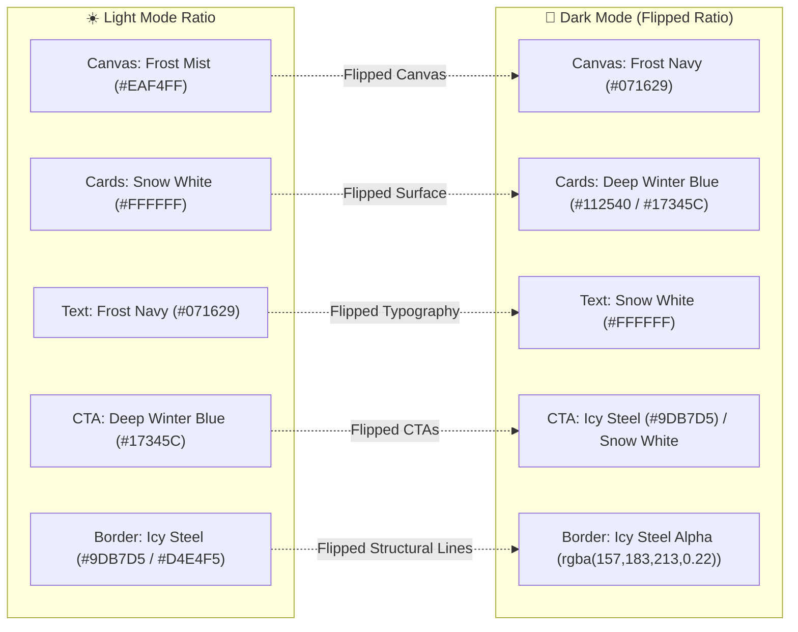

# QureFlow: Design System & Minimal Style Guide
*(Winter Arctic Frost Edition)*

**System:** QureFlow Real-Time Clinic Queue Management Platform  
**Design Philosophy:** Clinical minimalism with a serene, high-trust Arctic Frost palette. Engineered for low cognitive load in anxious waiting room environments and rapid, error-free clinical triage.  
**Core Technologies:** shadcn/ui (Radix Primitives + CSS Tokens), Font Awesome 6, Material UI (Material Symbols / `@mui/icons-material`).

---

## 1. Color Palette: The Winter Arctic Frost System

The visual language draws inspiration from crisp winter dawns: pure, clean surfaces for sterile clinical clarity, anchored by deep, authoritative midnight blues for typography, structure, and queue hierarchy.

```
┌────────────────────────────────────────────────────────────────────────┐
│  FROST NAVY           #071629  Deep frozen midnight                    │
├────────────────────────────────────────────────────────────────────────┤
│  DEEP WINTER BLUE     #17345C  Rich cold primary                       │
├────────────────────────────────────────────────────────────────────────┤
│  ICY STEEL            #9DB7D5  Cool metallic accent                    │
├────────────────────────────────────────────────────────────────────────┤
│  FROST MIST           #EAF4FF  Light icy background                    │
├────────────────────────────────────────────────────────────────────────┤
│  SNOW WHITE           #FFFFFF  Pure clean surface                      │
└────────────────────────────────────────────────────────────────────────┘
```

### Color Roles & Semantic Architecture

* **Primary Colors (Surfaces & Spatial Foundation):**
  * **Snow White (`#FFFFFF`):** Pure sterile surface used for cards, dialogs, dropdowns, input containers, and active sheet layers.
  * **Frost Mist (`#EAF4FF`):** Light icy app canvas background; eliminates screen glare while establishing an atmospheric, calming aura.
* **Secondary Colors (Brand Identity, Queue Engine & High-Contrast CTAs):**
  * **Deep Winter Blue (`#17345C`):** Rich cold primary tone; used for primary CTA buttons, active queue position badges, selected tab pills, and key interactive highlights.
  * **Frost Navy (`#071629`):** Deep frozen midnight tone; used for screen hero headers, high-contrast typography, top navigation bars, and dense clinic table headers.
* **Accent Colors (Precision Accents & Structural Borders):**
  * **Icy Steel (`#9DB7D5`):** Cool metallic accent; used for hairline dividers, input focus rings, subtle chip borders, secondary icons, and muted metadata pills.
  * **Shade of Black — Midnight Obsidian (`#050B14`):** Deepest black-navy tone suited for maximum contrast typography, dark mode canvas base, and sharp borders.

---

## 2. High-Contrast Readability Rule (WCAG AAA Mandatory)

> [!IMPORTANT]
> **CRITICAL ACCESSIBILITY & CONTRAST MANDATE:**  
> Any text, icon, or visual indicator placed over Secondary Blues (**`Deep Winter Blue #17345C`** or **`Frost Navy #071629`**) **MUST ALWAYS USE LIGHT COLORS** — predominantly **`Snow White #FFFFFF`** or **`Frost Mist #EAF4FF`**. Dark or muted text over secondary blues is strictly prohibited.

### Contrast Verification Matrix

| Background Color | Foreground Color | Calculated Contrast Ratio | WCAG Compliance Level | Intended Usage |
| :--- | :--- | :--- | :--- | :--- |
| **Frost Navy (`#071629`)** | **Snow White (`#FFFFFF`)** | **17.5 : 1** | **WCAG AAA** (Pass) | Primary buttons, app headers, modal title bars |
| **Deep Winter Blue (`#17345C`)** | **Snow White (`#FFFFFF`)** | **9.8 : 1** | **WCAG AAA** (Pass) | Active queue token hero, primary interactive CTAs |
| **Deep Winter Blue (`#17345C`)** | **Frost Mist (`#EAF4FF`)** | **8.4 : 1** | **WCAG AAA** (Pass) | Secondary button text, subheadings, chip labels |
| **Deep Winter Blue (`#17345C`)** | **Icy Steel (`#9DB7D5`)** | **4.9 : 1** | **WCAG AA** (Pass) | Supporting metadata, timestamps, inactive icons |
| **Snow White (`#FFFFFF`)** | **Frost Navy (`#071629`)** | **17.5 : 1** | **WCAG AAA** (Pass) | Card primary text, table body text, form input text |
| **Frost Mist (`#EAF4FF`)** | **Deep Winter Blue (`#17345C`)** | **8.4 : 1** | **WCAG AAA** (Pass) | Canvas section headers, breadcrumbs, link accents |

---

## 3. Dark Mode Architecture: Flipped Color Ratio

Dark mode in QureFlow is engineered by **directly flipping the surface-to-content color ratio**, maintaining the exact same serene Arctic aesthetic while completely eliminating eye fatigue during night clinic shifts or dimly lit waiting rooms:



### Complete Light vs. Dark Mode Token Mapping

| UI Role Token | Light Mode (Default) | Dark Mode (Flipped) | Description & Clinical Purpose |
| :--- | :--- | :--- | :--- |
| **`--color-canvas`** | `Frost Mist` (`#EAF4FF`) | `Frost Navy` (`#071629`) | App background viewport; low-glare in both modes. |
| **`--color-surface`** | `Snow White` (`#FFFFFF`) | `Deep Midnight Surface` (`#0D1F38` or `#17345C`) | Elevated cards, dialogs, drawers, and form fields. |
| **`--color-surface-subtle`**| `Frost Mist` (`#EAF4FF`) | `Deep Winter Blue` (`#17345C`) | Inactive tabs, hover states, secondary input wells. |
| **`--color-text-primary`** | `Frost Navy` (`#071629`) | `Snow White` (`#FFFFFF`) | Screen titles, token hero numbers, patient names. |
| **`--color-text-secondary`**| `Deep Winter Blue` (`#17345C`) | `Frost Mist` (`#EAF4FF`) | Field labels, table headers, supporting instructions. |
| **`--color-text-muted`** | `Slate Frost` (`#475569`) | `Icy Steel` (`#9DB7D5`) | Timestamps, character counters, helper microcopy. |
| **`--color-border`** | `Icy Steel Tint` (`#D4E4F5` / `#9DB7D5`)| `Icy Steel Alpha` (`rgba(157, 183, 213, 0.22)`)| 1px hairline dividing lines and card outlines. |
| **`--color-cta-primary`** | `Deep Winter Blue` (`#17345C`)| `Icy Steel` (`#9DB7D5`) or `Snow White` (`#FFF`)| Dominant action button background. |
| **`--color-cta-text`** | `Snow White` (`#FFFFFF`) | `Frost Navy` (`#071629`) | Text inside dominant action buttons. |
| **`--color-queue-active`** | `Deep Winter Blue` (`#17345C`)| `Frost Mist` (`#EAF4FF` on `#17345C`)| Active queue token card background & ring. |

### Feedback Semantic Tokens (Both Modes)
* **Success (Verified, Done, On-Time):**  
  * Light: Text `#047857`, Surface `#ECFDF5`, Border `#A7F3D0`  
  * Dark: Text `#34D399`, Surface `#064E3B`, Border `#059669`
* **Warning (Break, Delay, 1 Patient Ahead):**  
  * Light: Text `#B45309`, Surface `#FFFBEB`, Border `#FDE68A`  
  * Dark: Text `#FBBF24`, Surface `#78350F`, Border `#D97706`
* **Error / Destructive (No-Show, Missed Window, Disconnected):**  
  * Light: Text `#B91C1C`, Surface `#FEF2F2`, Border `#FECACA`  
  * Dark: Text `#F87171`, Surface `#7F1D1D`, Border `#DC2626`

---

## 4. Typography Scale & Hierarchy

* **Heading Font:** **Netflix Sans** (geometric, architectural, bold authority)  
  *Fallback Stack:* `-apple-system, BlinkMacSystemFont, "Segoe UI", Roboto, sans-serif`
* **Body & Numerical Font:** **Inter** (neutral, ultra-legible, optimized for dense tables, timers, and token badges)  
  *Fallback Stack:* `system-ui, sans-serif`

| Level | Font Family | Size | Weight | Line Height | Tracking | Primary Light Color | Primary Dark Color |
| :--- | :--- | :--- | :--- | :--- | :--- | :--- | :--- |
| **Display / Token Hero** | *Netflix Sans* | `40px` (2.50rem) | 800 (ExtraBold)| `1.1` (44px) | `-0.03em` | `#071629` / `#FFFFFF` | `#FFFFFF` |
| **H1 (Screen Title)** | *Netflix Sans* | `30px` (1.875rem)| 700 (Bold) | `1.2` (36px) | `-0.02em` | `#071629` | `#FFFFFF` |
| **H2 (Section Header)**| *Netflix Sans* | `22px` (1.375rem)| 600 (SemiBold) | `1.3` (28px) | `-0.01em` | `#071629` | `#EAF4FF` |
| **H3 (Card Title)** | *Netflix Sans* | `17px` (1.0625rem)| 600 (SemiBold) | `1.4` (24px) | `0` | `#17345C` | `#FFFFFF` |
| **Body (Regular)** | *Inter* | `15px` (0.9375rem)| 400 (Regular) | `1.5` (22px) | `0` | `#071629` | `#EAF4FF` |
| **Body Medium (Inputs)**| *Inter* | `15px` (0.9375rem)| 500 (Medium) | `1.5` (22px) | `0` | `#071629` | `#FFFFFF` |
| **Caption / Small** | *Inter* | `12px` (0.75rem) | 600 (SemiBold) | `1.4` (16px) | `+0.02em` | `#475569` | `#9DB7D5` |
| **Micro / Status** | *Inter* | `11px` (0.6875rem)| 700 (Bold) | `1.2` (14px) | `+0.04em` | `#17345C` | `#EAF4FF` |

---

## 5. Iconography System: Font Awesome & Material UI

QureFlow utilizes a dual-engine iconography suite: **Font Awesome 6** for rich healthcare & domain-specific representations, and **Material UI (Material Symbols / `@mui/icons-material`)** for functional interface controls, camera viewfinders, and navigation.

### Sizing Scale & Usage Rules
* **Micro (14px):** Inside status badges, chip indicators, and helper tooltips.
* **Regular (18px):** Form input pre/suffixes, table row action buttons, and secondary links.
* **Medium (22px):** Top navigation bars, tab trigger icons, and modal action headers.
* **Large / Hero (32px – 40px):** Camera scanning reticle centers, empty-state illustrations, and turn notification chimes.

### Icon Standard Mapping Reference

| Clinical / UI Feature | Font Awesome Icon (`fa-*`) | Material UI Equivalent (`@mui/icons-material`) | Semantic Tint |
| :--- | :--- | :--- | :--- |
| **QR Code & Arrival Scanner** | `fa-solid fa-qrcode` | `QrCodeScanner` | `Icy Steel` / `Deep Winter Blue` |
| **Doctor & Specialist** | `fa-solid fa-user-doctor` | `MedicalServices` | `Deep Winter Blue` |
| **Patient Profile** | `fa-solid fa-user` | `PersonOutline` | `Frost Navy` |
| **Waiting Time / Timers** | `fa-regular fa-clock` | `AccessTime` | `Deep Winter Blue` |
| **Live Queue / Turn Calling** | `fa-solid fa-users-line` | `PeopleAlt` | `Deep Winter Blue` |
| **Stethoscope / Consultation** | `fa-solid fa-stethoscope` | `LocalHospital` | `Deep Winter Blue` |
| **Blood Pressure / Vitals** | `fa-solid fa-heart-pulse` | `MonitorHeart` | `#EF4444` (Pulse Red) |
| **Blood Sugar Indicator** | `fa-solid fa-droplet` | `WaterDrop` | `#F59E0B` (Amber) |
| **Body Weight Indicator** | `fa-solid fa-weight-scale` | `Scale` | `Deep Winter Blue` |
| **Checkmark / Verified** | `fa-solid fa-circle-check` | `CheckCircle` | `#10B981` (Success Green) |
| **Warning / Doctor Break** | `fa-solid fa-triangle-exclamation` | `WarningAmber` | `#F59E0B` (Amber) |
| **No-Show / Cancelled** | `fa-solid fa-user-xmark` | `PersonOff` | `#EF4444` (Error Red) |
| **Walk-In Registration** | `fa-solid fa-user-plus` | `PersonAdd` | `Deep Winter Blue` |
| **Real-time Live Sync** | `fa-solid fa-arrows-rotate` | `Sync` (spinning on update) | `#10B981` (Live Green) |

> [!TIP]
> **Icon Contrast Rule:** When an icon is rendered inside a button or pill featuring a `Deep Winter Blue (#17345C)` or `Frost Navy (#071629)` background, the icon color **MUST BE `#FFFFFF` (Snow White)** or **`#EAF4FF` (Frost Mist)**.

---

## 6. Component System: shadcn/ui Architecture

All UI components are built following the **shadcn/ui** design system standard (accessible Radix UI headless primitives + Tailwind CSS / Vanilla CSS tokens), styled strictly to the Arctic Frost palette with a **single unified 8px border radius**.

### Unified Border Radius Rule
$$\mathbf{Radius = 8px\ (\text{STRICT\ SINGLE\ VALUE})}$$
*Applied uniformly to all Buttons, Input fields, Cards, Dropdowns, Badges, Tables, and Sheet Drawers.*

---

### Component Specifications

#### A. Button (`shadcn/ui: button`)
* **Height:** `44px` | **Padding:** `0 20px` | **Radius:** `8px` | **Font:** `Inter 600, 14px`
* **Variants:**
  * **Primary (Default):**
    * *Light:* Background `Deep Winter Blue (#17345C)`, Text `Snow White (#FFFFFF)`, Border `none`.
    * *Hover:* Background `Frost Navy (#071629)`.
    * *Dark:* Background `Icy Steel (#9DB7D5)`, Text `Frost Navy (#071629)`, Hover `Snow White (#FFFFFF)`.
  * **Secondary:**
    * *Light:* Background `Frost Mist (#EAF4FF)`, Text `Deep Winter Blue (#17345C)`, Border `1px solid #D4E4F5`.
    * *Hover:* Background `rgba(157, 183, 213, 0.25)`.
    * *Dark:* Background `rgba(157, 183, 213, 0.15)`, Text `Snow White (#FFFFFF)`, Border `1px solid rgba(157, 183, 213, 0.3)`.
  * **Destructive:**
    * Background `#FEF2F2`, Text `#EF4444`, Border `1px solid #FECACA`. Hover: Background `#FEE2E2`.
  * **Ghost / Outline:**
    * Background `transparent`, Text `Frost Navy (#071629)`, Border `1px solid #9DB7D5`.

#### B. Card (`shadcn/ui: card`)
* **Background:** `Snow White (#FFFFFF)` (Light) / `Deep Midnight Surface (#0D1F38)` (Dark)
* **Border:** `1px solid #D4E4F5` (Light) / `1px solid rgba(157, 183, 213, 0.22)` (Dark)
* **Border Radius:** `8px`
* **Padding:** `20px` (standard container gutter)
* **Shadow:** `0 1px 3px rgba(7, 22, 41, 0.05), 0 1px 2px rgba(7, 22, 41, 0.03)`
* **Active Queue Token Card Special:** Card features an inset left border of `4px solid #17345C` (Light) or `4px solid #9DB7D5` (Dark).

#### C. Input & Label (`shadcn/ui: input`, `label`)
* **Height:** `44px` | **Padding:** `0 14px` | **Radius:** `8px` | **Font:** `Inter 15px`
* **Default:** Background `Snow White (#FFFFFF)`, Border `1px solid #D4E4F5`, Text `Frost Navy (#071629)`.
* **Focus State:** Border `Deep Winter Blue (#17345C)`, Box-shadow `0 0 0 3px rgba(23, 52, 92, 0.15)`.
* **Error State:** Border `#EF4444`, Box-shadow `0 0 0 3px rgba(239, 68, 68, 0.15)`.
* **Placeholder:** `#9DB7D5` (Icy Steel).

#### D. Badge (`shadcn/ui: badge`)
* **Height:** `24px` | **Padding:** `2px 10px` | **Radius:** `8px` | **Font:** `Inter 12px, 600`
* **Blue (In Queue / Active Token):** Background `#EAF4FF`, Text `#17345C`, Border `1px solid #D4E4F5`.
* **Green (Completed / Verified Arrival):** Background `#ECFDF5`, Text `#047857`, Border `1px solid #A7F3D0`.
* **Amber (Doctor on Break / 1 Patient Ahead):** Background `#FFFBEB`, Text `#B45309`, Border `1px solid #FDE68A`.
* **Red (No-Show / Cancelled / Urgent):** Background `#FEF2F2`, Text `#B91C1C`, Border `1px solid #FECACA`.

#### E. Dialog & Modal (`shadcn/ui: dialog`, `alert-dialog`)
* **Overlay:** `rgba(7, 22, 41, 0.65)` (Frost Navy backdrop blur filter: `blur(4px)`).
* **Content:** Background `Snow White (#FFFFFF)`, Border `1px solid #D4E4F5`, Radius `8px`, Padding `24px`.
* **Turn Notification Special:** When doctor triggers `CHECK_UP`, dialog launches with a `Deep Winter Blue (#17345C)` header, `Snow White (#FFFFFF)` text, and audio bell chime.

#### F. Sheet / Drawer (`shadcn/ui: sheet`)
* Used on Screen 06 for **Add Walk-In Patient** and on Screen 07 for **Up-Next Queue Preview**.
* Slide-over container with `width: 420px`, Background `Snow White (#FFFFFF)`, Radius `8px 0 0 8px`, Border-left `1px solid #D4E4F5`.

#### G. Tabs (`shadcn/ui: tabs`)
* Segmented control with `height: 40px`, Background `#EAF4FF`, Radius `8px`, Padding `3px`.
* Active tab pill: Background `Snow White (#FFFFFF)`, Text `Deep Winter Blue (#17345C)`, Shadow `0 1px 2px rgba(7, 22, 41, 0.08)`.

#### H. Table (`shadcn/ui: table`)
* Used on Screen 06 (Reception Console).
* **Header:** Background `#EAF4FF` (Light) / `#17345C` (Dark), Text `Deep Winter Blue (#17345C)` (Light) / `Snow White (#FFFFFF)` (Dark), Height `40px`, Font `12px SemiBold`.
* **Row:** Height `52px`, Border-bottom `1px solid #EAF4FF`, Hover: `rgba(234, 244, 255, 0.5)`.

#### I. Skeleton (`shadcn/ui: skeleton`)
* Background `linear-gradient(90deg, #EAF4FF 25%, #D4E4F5 50%, #EAF4FF 75%)`, Background-size `200% 100%`, Animation `pulse 1.5s ease-in-out infinite`, Radius `8px`.

#### J. Toast / Sonner (`shadcn/ui: toast`)
* Bottom-right floating notifications for queue changes, no-shows, and network reconnects.

---

## 7. CSS Custom Properties (:root & .dark)

```css
/* ==========================================================================
   QUREFLOW WINTER ARCTIC FROST DESIGN SYSTEM — CSS CUSTOM PROPERTIES
   ========================================================================== */

:root {
  /* --- Arctic Frost Palette Primitives --- */
  --frost-navy: #071629;
  --deep-winter-blue: #17345C;
  --icy-steel: #9DB7D5;
  --frost-mist: #EAF4FF;
  --snow-white: #FFFFFF;
  --midnight-black: #050B14;

  /* --- Semantic Light Mode Tokens --- */
  --background: var(--frost-mist);
  --foreground: var(--frost-navy);
  
  --card: var(--snow-white);
  --card-foreground: var(--frost-navy);

  --popover: var(--snow-white);
  --popover-foreground: var(--frost-navy);

  --primary: var(--deep-winter-blue);
  --primary-foreground: var(--snow-white);

  --secondary: var(--frost-mist);
  --secondary-foreground: var(--deep-winter-blue);

  --muted: #F1F7FD;
  --muted-foreground: var(--frost-navy);

  --accent: var(--icy-steel);
  --accent-foreground: var(--frost-navy);

  --destructive: #EF4444;
  --destructive-foreground: var(--snow-white);

  --border: #D4E4F5;
  --input: #D4E4F5;
  --ring: var(--deep-winter-blue);

  /* --- Feedback Colors --- */
  --success: #10B981;
  --success-bg: #ECFDF5;
  --warning: #F59E0B;
  --warning-bg: #FFFBEB;
  --error: #EF4444;
  --error-bg: #FEF2F2;

  /* --- Typography --- */
  --font-heading: 'Netflix Sans', -apple-system, sans-serif;
  --font-body: 'Inter', -apple-system, sans-serif;

  /* --- Unified Strict Radius --- */
  --radius: 8px;

  /* --- Spacing Scale (4px Base) --- */
  --space-1: 4px;
  --space-2: 8px;
  --space-3: 12px;
  --space-4: 16px;
  --space-6: 24px;
  --space-8: 32px;
  --space-12: 48px;

  /* --- Elevation Shadows --- */
  --shadow-card: 0 1px 3px rgba(7, 22, 41, 0.05), 0 1px 2px rgba(7, 22, 41, 0.03);
  --shadow-elevated: 0 4px 12px rgba(7, 22, 41, 0.08), 0 2px 4px rgba(7, 22, 41, 0.04);
}

/* ==========================================================================
   DARK MODE — FLIPPED RATIO ARCHITECTURE
   ========================================================================== */

.dark, [data-theme="dark"] {
  --background: var(--frost-navy);
  --foreground: var(--snow-white);

  --card: #0D1F38;
  --card-foreground: var(--snow-white);

  --popover: #0D1F38;
  --popover-foreground: var(--snow-white);

  --primary: var(--icy-steel);
  --primary-foreground: var(--frost-navy);

  --secondary: var(--deep-winter-blue);
  --secondary-foreground: var(--snow-white);

  --muted: #112540;
  --muted-foreground: var(--icy-steel);

  --accent: var(--deep-winter-blue);
  --accent-foreground: var(--snow-white);

  --destructive: #F87171;
  --destructive-foreground: var(--frost-navy);

  --border: rgba(157, 183, 213, 0.22);
  --input: rgba(157, 183, 213, 0.25);
  --ring: var(--icy-steel);

  --shadow-card: 0 1px 3px rgba(0, 0, 0, 0.35);
  --shadow-elevated: 0 4px 16px rgba(0, 0, 0, 0.5);
}
```

---

## 8. Prompt-Ready Style Guide Block

> **Copy and paste this block into any prompt to enforce 100% UI consistency:**

```markdown
[STYLE GUIDE: QureFlow Winter Arctic Frost UI]
- Primary Palette: Snow White (#FFFFFF) & Frost Mist (#EAF4FF).
- Secondary Palette: Deep Winter Blue (#17345C) & Frost Navy (#071629).
- Accent Palette: Icy Steel (#9DB7D5) & Shade of Black (#050B14).
- Contrast Rule: Any text/icon placed over secondary blues (#17345C, #071629) MUST use light colors (#FFFFFF or #EAF4FF).
- Dark Mode: Flipped color ratio (Canvas: #071629, Cards: #0D1F38 / #17345C, Text: #FFFFFF, Borders: rgba(157,183,213,0.22)).
- Feedback: Success #10B981 (#ECFDF5) | Warning #F59E0B (#FFFBEB) | Error #EF4444 (#FEF2F2).
- Iconography: Font Awesome 6 (fa-*) & Material UI (@mui/icons-material). Always #FFF over secondary blue.
- Components: shadcn/ui (Radix + CSS Variables): Button, Card, Badge, Input, Dialog, Sheet, Tabs, Table, Select, Skeleton.
- Strict Unified Radius: 8px on ALL buttons, inputs, cards, dialogs, badges, and sheets.
- Typography: Headings: 'Netflix Sans', 700/600 | Body & Inputs: 'Inter', 400/500/600.
- Buttons: h: 44px, r: 8px, px: 20px, font: 14px/600. Primary: #17345C (text #FFFFFF). Secondary: #EAF4FF (text #17345C).
- Inputs: h: 44px, r: 8px, bg: #FFFFFF, border: 1px #D4E4F5, focus: #17345C ring (3px/15%), text: 15px #071629.
- Badges: h: 24px, r: 8px, px: 10px, font: 12px/600, bg: light tint, text: saturated status color.
- Layout: Sterile clinical calm, zero clutter, single dominant CTA per screen.
```
